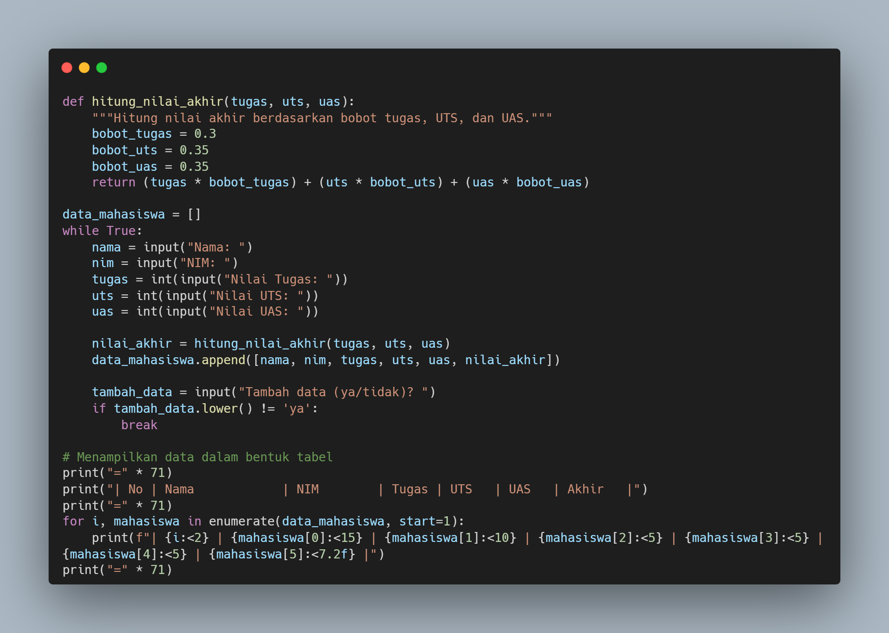
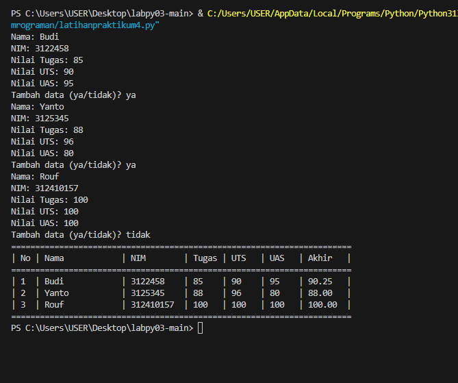

# Tugas praktikum4
Nama : Ro'uf Muhammad Fauzan

NIM : 312410157

Kelas : TI.24.A1

# Flowchart input dan outpu dari Praktikum 4
## Berikut flowchart

## Berikut input

## Berikut output


## 1. Fungsi hitung_nilai_akhir(tugas, uts, uas):
```
def hitung_nilai_akhir(tugas, uts, uas):
    """Hitung nilai akhir berdasarkan bobot tugas, UTS, dan UAS."""
    bobot_tugas = 0.3
    bobot_uts = 0.35
    bobot_uas = 0.35
    return (tugas * bobot_tugas) + (uts * bobot_uts) + (uas * bobot_uas)
```
- Fungsi ini menerima 3 parameter: nilai tugas, UTS, dan UAS
- Menghitung nilai akhir dengan bobot:
  - Tugas: 30% (0.30)
  - UTS: 35% (0.35)
  - UAS: 35% (0.35)
- Mengembalikan hasil perhitungan nilai akhir

## 2. Bagian utama program:
```
data_mahasiswa = []
while True:
    nama = input("Nama: ")
    nim = input("NIM: ")
    tugas = int(input("Nilai Tugas: "))
    uts = int(input("Nilai UTS: "))
    uas = int(input("Nilai UAS: "))

    nilai_akhir = hitung_nilai_akhir(tugas, uts, uas)
    data_mahasiswa.append([nama, nim, tugas, uts, uas, nilai_akhir])

    tambah_data = input("Tambah data (ya/tidak)? ")
    if tambah_data.lower() != 'ya':
        break
```
- Deklarasi variabel data_mahasiswa sebagai list kosong untuk menyimpan data mahasiswa.
- Loop while True digunakan untuk terus meminta input data mahasiswa hingga pengguna memilih untuk berhenti.
- Di dalam loop, program meminta input untuk:
  - nama (Nama mahasiswa)
  - nim (NIM mahasiswa)
  - tugas (Nilai tugas mahasiswa)
  - uts (Nilai UTS mahasiswa)
  - uas (Nilai UAS mahasiswa)
- Nilai akhir dihitung menggunakan fungsi hitung_nilai_akhir().
- Data mahasiswa kemudian ditambahkan ke dalam list data_mahasiswa dengan format: [nama, nim, tugas, uts, uas, nilai_akhir].
- Setelah memasukkan data, program bertanya kepada pengguna apakah ingin menambahkan data lagi. Jika pengguna memasukkan "ya" (tanpa memperhatikan huruf besar/kecil), loop akan berlanjut. Jika tidak, loop akan dihentikan.
